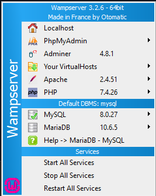
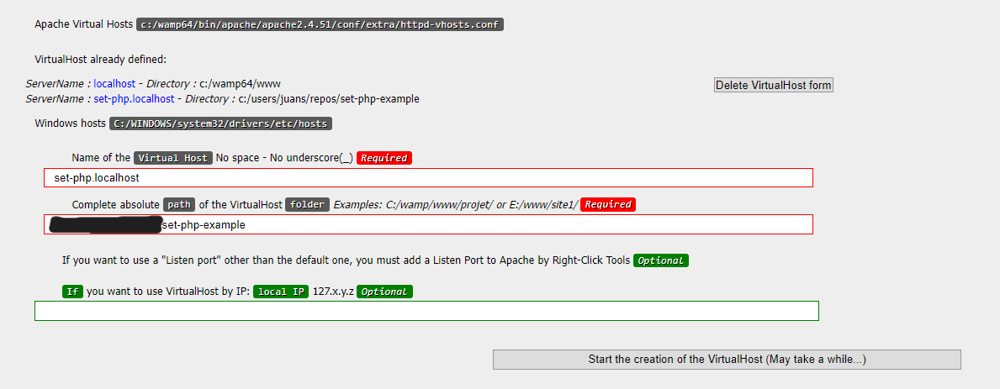
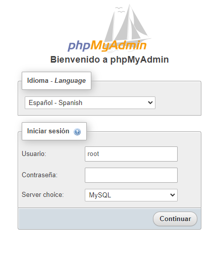
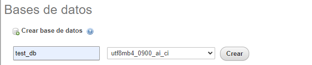
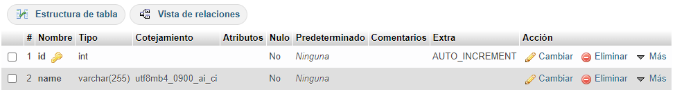
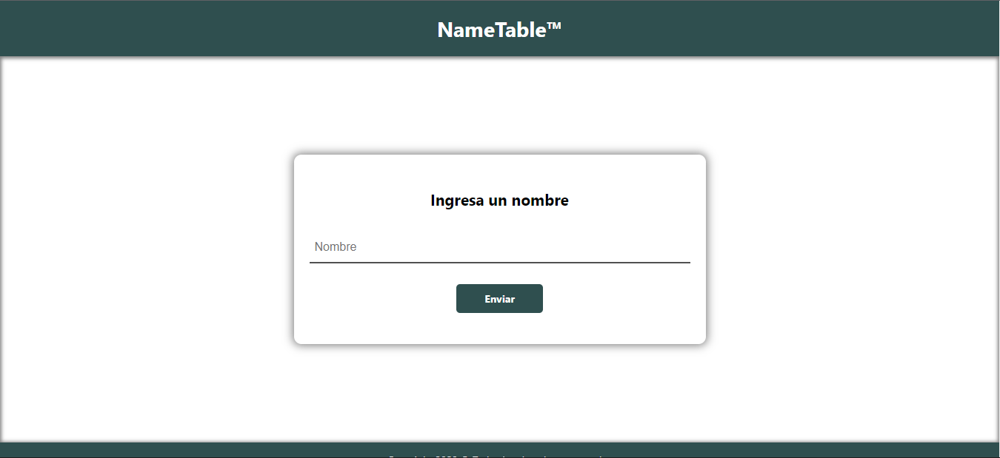

## NameTable PHP page

This repository has an example page in PHP with simple connection to MySQL database.

## Requirements

- WAMP Server (You could use XAMPP or any integration server that you prefer, but the settings images are of WAMP)
- Git
- Any text editor

## Running on localhost

### Download project

```
git clone https://github.com/juansedo/set-php-example.git
```

### Configure a Virtual Host

In WAMP Menu you can found "Your VirtualHosts" option.



Go to this and add a new Virtual Host:



Default virtual host must be `set-php.localhost` (or you must change the code) and you can add as absolute path the repository directory (it's not necessary to move information to `www`).

Restart Apache and then test the virtual host.


### Configure database

Login to phpmyadmin. Default user is `root` with no password.



Once inside, you must create a database called `test_db`, with a `names` table and two columns: an autoincrement `id` column and a varchar `name` column.






## Test

Now, you can test the page in `set-php.localhost` on your preferred browser, writing and sending names to MySQL database.



## Contributors

- *Creator* - Juan Sebastián Díaz Osorio - *juansedo* <a href="https://github.com/juansedo"></a> <a href="https://instagram.com/juansedo"></a>
